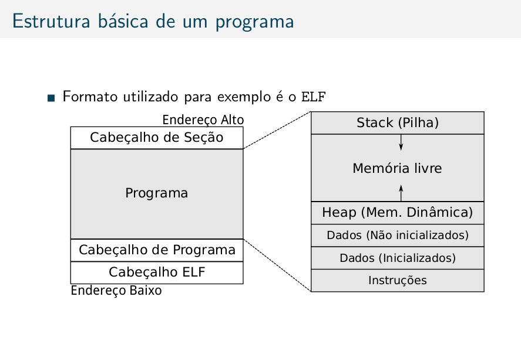

# Program structure

- cabeçalho ELF (linux) receita de como construir o programa em memória
- stack (variáveis de funções)
- free memory
- heap (memória dinâmica, ponteiros, mallocs e callocs)
- dados não inicializados (variáveis globais)
- dados inicializados (constantes)
- instruções

- little endian (menos significativos no endereço mais baixo)
- é por convenção
- big endian é o contrário
- .text
- .data

## Não existem tipos de dados
> existem instruções. dados são só bits
> 4096 bytes são páginas. não só tripa de bytes
> esses 400000 anteriores são tabelas de simbolos, dados inicializados, etc.
> na linguagem de progração existe o tipo antes do dado, no assembly, não.
> dados não possuem tipo
> w no nasm é 2
> w no gdb é 4 e h no gdb é 2
> se coloca , vira vetor, por isso não dá warning
> se não coloca, dá warning
> dq é 8 bytes